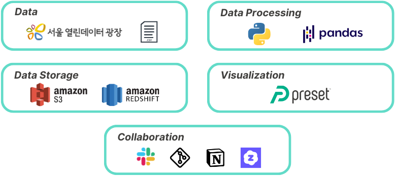

# ✅ 프로젝트 주제
#### **서울시 운동 환경 지역 격차 분석 대시보드**
- 목표:
    - 서울시 자치구별 운동 관련 인프라와 건강지표(신체 활동률, 비만율 등)의 관계를 분석하고, 
      **지역별 격차 요인을 시각적으로 파악**해 인사이트를 도출하고자 함
- 프로젝트 기간: 2025.05.15.(목) ~ 2025.05.20.(화) 

## 프로젝트 소개
### ❓ 주제 선정 배경
- 건강한 삶에 대한 관심이 높아지면서 운동의 필요성에 대한 인식이 확산됨
- 운동 신천율에 영향을 주는 환경적 요인(시설 접근성, 인구 구성 등)이 존재함
- 서울시 자치구별로 운동 환경의 격차가 뚜렷하게 나타남 -> 이에 대한 문제의식 형성

### 🎯 분석 목표
1. 자치구별 시설, 인구, 면적 등의 데이터를 종합 분석해 지역 간 인프라 차이 시각화
2. 공공데이터 기반 자치구별 운동 관련 인사이트 제공
3. 운동 환경 관련 요인 도출 및 정책적 시사점 제시

### 🛠️ 개발환경

### ⚙️ 데이터 아키텍처 흐름도

### ⛓️ ERD

### 🔗 데이터 소스(원본 데이터)
- 서울 열린데이터 광장
    - 서울시 공공체육시설 정보
        - https://data.seoul.go.kr/dataList/OA-21779/S/1/datasetView.do
    - 서울시 체력단련장업 인허가 정보
        - https://data.seoul.go.kr/dataList/OA-16142/S/1/datasetView.do 
    - 서울시 상권분석서비스(길단위인구-자치구)
        - https://data.seoul.go.kr/dataList/OA-22179/S/1/datasetView.do 
    - 서울시 등록인구(연령별/동별) 통계
        - https://data.seoul.go.kr/dataList/10718/S/2/datasetView.do
    - 서울시 행정구역(구별) 통계
        - https://data.seoul.go.kr/dataList/412/S/2/datasetView.do
    - 서울시 따릉이대여소 마스터 정보
        - https://data.seoul.go.kr/dataList/OA-21235/S/1/datasetView.do
    - 서울시 지역사회 건강통계(건강행태) 통계
        - https://data.seoul.go.kr/dataList/10649/S/2/datasetView.do

